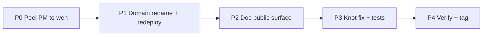

# Knot launch form — public path

**Status:** settled for implementation planning (2026-08-04)  
**Branch:** `feat/launch-form-knot`

Inputs: [`launch-gap-map-2026-08.md`](launch-gap-map-2026-08.md),
[`doc-hygiene-inventory.md`](doc-hygiene-inventory.md),
[`security-audit-2026-08-04.md`](security-audit-2026-08-04.md),
[`security-model.md`](security-model.md).

## Public claim (locked wording)

Knot is an M-of-N BLS multisig suite for Dusk: on-chain registry and proposals
(`call_raw`), canonical encoding, a local signing Lab, and an optional
untrusted collector. Quorum authorization is **Prove mode** — the chain
re-verifies membership, threshold, and signatures. The Lab holds keys and
helps operators sign; it is **not** the final authority.

Prediction-market council resolve is a **consumer** of the registry. Its
message digest and host tooling live with **wen** / prediction-market, not
as a first-class Knot surface.

## Locked product decisions (L1–L9)

| ID | Decision |
|---|---|
| L1 | Knot public-ready playbook first → chit → ambit |
| L2 | Prove only (no pure-Coord offer) |
| L3 | PM tooling → wen |
| L4 | Knot keeps: encoding, registry, proposals, generic Lab/CLI, collector |
| L5 | Generic domains → `nocturne.knot.*` + version bump + redeploy |
| L6 | Lab = generic proposals demo; rename “treasury” UI copy |
| L7 | `council_resolve_*` leaves encoding → wen |
| L8 | Knot ↛ wen; wen → knot |
| L9 | Council domain pinned: `nocturne.wen.prediction-market.council-resolve.v3` |

### Domain strings (pinned)

| Constant | New value | Home |
|---|---|---|
| Proposal | `nocturne.knot.multisig.proposal.v2` | knot `knot-encoding` |
| Change account | `nocturne.knot.multisig-registry.change_account.v2` | knot `knot-encoding` |
| Council resolve | `nocturne.wen.prediction-market.council-resolve.v3` | wen (after peel) |

## Settled packaging / docs defaults

| Topic | Settlement |
|---|---|
| First public crates | All five; **AGPL collector** called out in README (Apache suite + AGPL relay) |
| Collector `pm_council_resolve` blob kind | **Peel with PM tooling** to wen (or drop if wen brings its own relay shape) — knot collector stays generic proposal blobs |
| Prove claim | Top of root README + security-model (gap **B1**) |
| `docs/versioning.md` | **Add short** SSOT (PINNED-DIFFERENT-REDEPLOYED + testnet-only) — gap **B3** |
| PM-resolve caveat (**B2**) | Becomes wen’s problem after peel; knot README must not claim PM-resolve |
| Kind C1–C4 | **Defer** (already honest) |
| C5 registry “Next steps” | **Doc-move** / reword: knot side done; consumer work is wen’s |
| C6 collector runbook | **Rewrite**: drop dead pointer; “BYO ops; API is the contract” |
| A6–A7 unbounded growth | **Ship** as ops responsibility (documented) |
| A8 member-pk ordering | **Improve** cheap: one doc sentence or canonicalize — not Critical |
| A9 `require_owner` footnote | **Doc** into security-model — cheap |
| A4 generic membership pre-check | **Improve**, not launch-blocking (Prove mitigates; do after peel if capacity) |
| Doc hygiene inventory | **Execute** keep-public / move-internal / delete-duplicate before public tag |

## Audit × gap crosswalk (after peel)

### Leaves knot with the peel — **must be fixed in wen, not dropped**

These are **not** “wontfix.” They move with the code. Tracking:

- Knot audit leaves `audit-2026-08-full/010–014` stay as the finding record / acceptance hints.
- **Wen (or prediction-market) paired plan** owns implementation: peel **and** close A1–A5 (membership gate, submit target crosscheck, shared/golden ABI, threshold warn) **before** wen publicly claims pm-resolve.
- Knot P0 only requires: paths gone from knot + wen has a tracked plan/leaves pointing at those findings. Closing Critical/High is a **wen launch bar**, not a knot tag bar.

| Gap | Audit | Action |
|---|---|---|
| A1 Critical membership gate | PM-resolve sign | Peel → **fix in wen** (acceptance from leaf 010) |
| A2 High submit target | PM-resolve submit | Peel → **fix in wen** (leaf 011) |
| A3 High mirrored ABI | `pm_*_types.rs` | Peel → **extract/goldens in wen** (leaf 012) |
| A5 Medium threshold warn | PM-resolve init | Peel → **fix in wen** (leaf 014) |
| Council digest / L7–L9 | encoding + PM | Peel + domain `nocturne.wen…v3` in wen |

### Remains knot launch work

| Gap | Severity / kind | Launch bar |
|---|---|---|
| A10 | rpc.rs untested | **Required** for remaining generic handlers (propose/approve/quorum/change_account) — not full 2k-line PM surface |
| A11 | CLI/RPC duplication | **Discuss → extract** shared gate-then-sign while fixing A4/A10 (cleanliness) |
| A12 | README version drift | **Required** |
| A13 | GitHub link → sme_platform | **Required** |
| A14 | Dead `../../../` links | **Required** (hygiene inventory) |
| A15 | Dead `references/testnet-wallet.md` in CLI errors | **Required** |
| A16 | Domain `sme-platform` prefix | **Superseded by L5** (rename) |
| B1 | Prove not on front door | **Required** |
| B3 | Missing versioning.md | **Required** |
| L6 | “Treasury” Lab copy | **Required** |
| Doc hygiene | Meta Status / wave archaeology | **Required** for public front door |

### Explicit non-blockers for first public tag

A6, A7, A8 (if documented), A9 (if documented), A4 (follow-up), C1–C4, external firm audit, crates.io, hosted Lab subdomain.

## Public launch path (phases)

### P0 — Peel (knot + wen, coordinated)

1. Move PM-resolve CLI/UI/RPC, `pm_*_types`, standalone PM UI to wen.  
2. Move `council_resolve_*` out of `knot-encoding` into wen; set domain **L9**.  
3. Strip PM routes/flags from `knot-tool`; collector: remove or relocate `pm_council_resolve` kind.  
4. Update wen docs that pointed at knot pm-resolve.  
5. Knot tree must not expose PM-resolve as a product surface.  
6. **Open wen plan/leaves** that import audit A1–A5 acceptance; schedule fixes in that plan (same wave as peel preferred; **required before wen public claim** of pm-resolve).

**Exit:** tests green on touched crates; no PM-resolve entrypoints in knot; wen has explicit fix tracking for A1–A5.

### P1 — Domain rename + redeploy (knot generics)

1. `DOMAIN_PROPOSAL` / `DOMAIN_CHANGE_ACCOUNT` → `nocturne.knot.*.v2`.  
2. Update encoding goldens + any fixtures.  
3. Redeploy registry + proposals (and wen council path on new digest) — accepted.  

**Exit:** known-vector tests pass; testnet Status IDs updated once (then Status leaves public README — see P2).

### P2 — Public doc + **website + standards docs** alignment

One claim everywhere. Review and align **all** of:

| Surface | Location (typical) |
|---|---|
| Repo front door | knot root + crate READMEs |
| In-repo docs | `docs/security-model.md`, new `versioning.md`, hygiene moves |
| Standards site | `nocturne-docs` → `/v1/knot/` (and any PM pages that still say pm-resolve lives in knot) |
| Marketing / Lab website copy | Multisig Lab HTML/JS strings (“treasury”, feature lists); any nocturne-standards marketing pages that mention Knot |

Work:

1. Rewrite root + crate READMEs: public claim (above), Prove-first, AGPL callout, no Wave/carve/§ Status dump.  
2. Execute [`doc-hygiene-inventory.md`](doc-hygiene-inventory.md): keep / move-to-`docs/internal/` or nocturne-docs / delete-duplicate.  
3. Add `docs/versioning.md`.  
4. Fix A12–A15 (versions, GitHub links, dead relatives, CLI error text).  
5. Lab copy: drop “treasury”; use committee / multisig account.  
6. **Pass over nocturne-docs `/v1/knot/`** (+ cross-links from wen/PM docs): peel story, Prove-only, no dead monorepo paths, no “pm-resolve in knot”.  
7. **Pass over website / Lab UI copy** for the same claim; file doc PRs in `nocturne-docs` (and any site repo) as part of this phase or a tightly paired PR.

**Exit:** fresh clone + docs site + Lab UI tell the same story; no parent-monorepo-only links; claim matches tree.

### P3 — Remaining knot fixes + tests

1. Generic Lab/RPC: membership/threshold **warnings** optional (A4); prefer shared extract (A11) if touching sign paths.  
2. Add focused tests for remaining `rpc.rs` / CLI generic paths (A10 residual).  
3. A8/A9 doc or small improve if not done in P2.  

**Exit:** no Critical/High **in knot tree**; Medium either fixed or explicitly deferred in launch-form.

### P4 — Verify + public-ready tag

1. Checklist: P0–P3 exits + `security-model.md` matches Prove + peel.  
2. Tag / README pin (e.g. `v0.2.0` or next agreed) — **no meta Status novel**.  
3. Export short **playbook** note for chit/ambit (what we learned).  

**Exit:** operator willing to point public docs + GitHub at this tree without apology.

## Success criteria (public Knot)

- [x] No PM-resolve product surface in knot  
- [x] Encoding has no council-resolve digest  
- [x] Domains use pinned `nocturne.knot.*` / wen string as above  
- [x] Public READMEs match claim; dead monorepo links gone  
- [x] Audit Critical/High either fixed in wen (moved) or absent from knot  
- [x] Collector AGPL disclosed  
- [x] Prove-only stated on front door  

_Verified 2026-08-04 on `feat/launch-form-knot` (`b4e5895`). Operator: redeploy registry+proposals, then tag._

## Next step

Two implementation plans (paired):

1. **Knot:** `docs/superpowers/plans/YYYY-MM-DD-knot-public-launch.md` — P0 (strip) + P1–P4, including nocturne-docs + website alignment tasks.  
2. **Wen:** paired plan in wen/prediction-market — receive peel + **fix A1–A5** + domain L9 + doc updates.

Audit fix leaves 010–014 remain the acceptance source for the wen plan; knot plan references them as “moved,” does not close them as fixed in knot.

## Out of scope

Chit/ambit execution; crates.io; external audit firm; mainnet.
